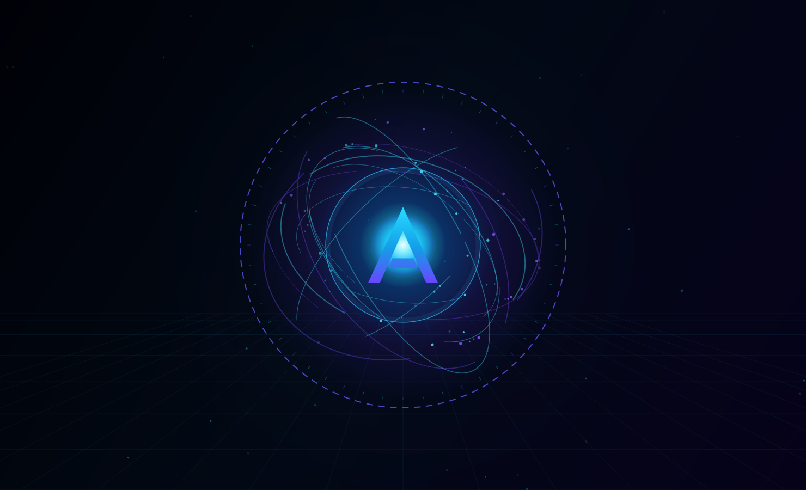
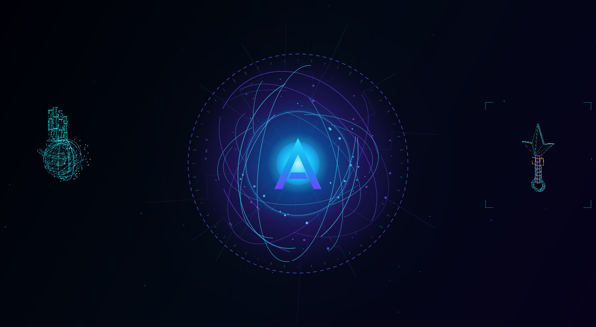
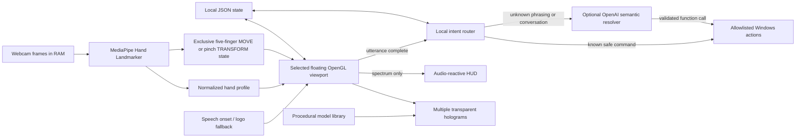

# ARIS — Augmented Reality Intelligence System

ARIS (**Augmented Reality Intelligence System**) is a Windows desktop portfolio beta that combines a privacy-aware hand-vision pipeline, gesture-controlled holographic 3D models, a bilingual assistant, and a deliberately small set of safe computer actions.

The project is designed as a software foundation for future Mechatronics experiments such as calibrated hand measurement, CAD export, and 3D-printed wearable prototypes.



## Why this project exists

ARIS explores one question: how can AI, computer vision, 3D graphics, and physical-product thinking work together in a single understandable prototype?

The beta focuses on a stable, honest demonstration:

- A PySide6 desktop interface inspired by cinematic holographic systems, using a clean dark
  gradient without a square perspective grid
- An audio-reactive ARIS energy orb with original cyan/purple orbital animation
- A dark-to-light startup reveal with outward circuit traces, a radial energy wave, and an
  optional synchronized local sound cue
- Continuous per-orbit animation without a shared short phase reset or visible snap
- Local voice-activity detection that starts on speech and stops after silence
- On-device, one-hand landmark tracking with MediaPipe
- Automatic open-palm scanning and a generated low-poly hand profile
- Conflict-free local gestures: five-finger movement plus pinch-locked horizontal rotation
- Six original procedural low-poly demo scenes
- English and Vietnamese UI/assistant behavior
- Voice-first HUD: spoken assistant replies do not display a transcript over the ARIS core;
  full text remains available only inside explicit Web Search information panels.
- Safe local commands for opening selected apps, volume, and allowlisted files, plus optional
  source-cited OpenAI Web Search
- Optional OpenAI responses and transcription behind an explicit opt-in
- JSON persistence without saved camera frames or permanent raw audio

The current beta generates geometry procedurally and selects forms through commands. Free-form AI-to-mesh generation and fabrication-ready export are roadmap items, not completed claims.

## Model library

The interface uses the requested display names:

1. Iron Man Mask
2. Iron Man Hand
3. Spider-Man Mask
4. Web Shooter
5. Rasengan
6. Minato Kunai

The public repository uses original low-poly procedural geometry and does not distribute extracted
game or film assets. Git-ignored user meshes may optionally replace any model during private
development; the procedural versions remain the portable fallbacks.



## Architecture



The code is separated by responsibility:

```text
src/aris/
├── ai/          # local intent routing and optional cloud replies
├── core/        # configuration and shared types
├── desktop/     # allowlisted Windows actions and safe paths
├── models/      # catalog, low-poly geometry, scene assembly
├── storage/     # atomic JSON persistence
├── ui/          # HUD state, audio core, floating model manager, OpenGL viewports
├── vision/      # MediaPipe tracking, hand scan, gesture math
└── voice/       # local VAD/audio monitor, transcription, speech output
```

## Requirements

- Windows 11
- Python 3.12 (64-bit)
- A webcam for scanning and gesture controls
- OpenGL-capable graphics hardware
- Internet access only for dependency installation and optional cloud AI

The first tested system uses an Intel Core i7-13650HX, 32 GB RAM, and an NVIDIA RTX 4050 Laptop GPU. The renderer intentionally uses low-poly geometry so less powerful modern hardware can also run it smoothly.

## Quick start

> **Source beta:** ARIS does not have a packaged `.exe` installer yet. Run it from a Python 3.12
> virtual environment with the commands below.

From PowerShell:

```powershell
git clone <your-repository-url>
cd Aris
py -3.12 -m venv .venv
.\.venv\Scripts\Activate.ps1
python -m pip install --upgrade pip
python -m pip install -e ".[vision,voice,dev]"
python -m aris
```

Or, after cloning, use the included helpers:

```powershell
powershell -ExecutionPolicy Bypass -File .\scripts\setup.ps1
powershell -ExecutionPolicy Bypass -File .\scripts\run.ps1
```

ARIS starts in `MOCK CORE` mode. The 3D viewer, hand tracking, gestures, app actions, file safety,
and volume routing do not require an OpenAI key. Source-cited Web Search remains unavailable until
both OpenAI and its separate search cost opt-in are enabled. Arduino support is also disabled in
the public example configuration until the user explicitly enables it after checking the wiring.

On startup, the `A` powers on first, then a light wave and circuit traces reveal the rest of the
HUD. Auto-listen opens only after this local sequence finishes, so ARIS does not interpret its own
startup sound as a user command. The main window opens maximized and computes its restore size from
Windows' available logical screen geometry, preventing high-DPI scaling from pushing the title bar
or resize edges outside the desktop.

## Controls

- Say `Hey ARIS` to open a ten-second command session. `Hey ARIS, mở Chrome` can wake and
  execute in one sentence. Confirmed user voice while the session is open extends the deadline;
  after ten silent seconds ARIS returns to standby and ignores commands until called again.
- The beta wake phrase is enforced after transcription, not by an offline biometric wake-word
  model. The microphone/VAD therefore remains active and detected utterances can still reach the
  configured transcription API while ARIS is in standby. Anyone who says the phrase can wake it.
- Click the central ARIS core once to listen and click it again to stop/submit as a fallback.
- Request models by voice; each appears as a background-free floating hologram while the ARIS
  logo and technology background remain visible. A new model starts centered over the ARIS core,
  eases forward into view, and may use a short local materialization cue.
- Drag a hologram with the mouse to move it. Click it to select which model receives hand gestures.
- Say `chọn Rasengan`, `điều khiển Minato Kunai`, or `select Iron Man Mask` to transfer
  gesture and unnamed voice-zoom control to an already-open model without spawning a duplicate.
- Say `close <model name>` / `tắt <tên model>` to close only that hologram. Say `end` /
  `kết thúc` to close all models, or use `Esc` as a developer fallback for the selected model.
  A bare `close` also dismisses the currently focused hologram or research panel; common STT
  variants such as `closed`, `closing`, `clothes`, and `clause` are normalized locally.
- Ask ARIS for precise local zoom without API cost: `phóng to Rasengan 30%`,
  `thu nhỏ Minato Kunai 20%`, `zoom in 15%`, or `thu nhỏ model đang chọn` (30% default).
  Voice zoom animates smoothly and each request is capped at 80% to keep the model visible.
- Show all five fingertips for a moment to lock MOVE mode, then guide the selected hologram
  around the HUD with the open hand.
- Pinch the thumb and index fingertip together to lock TRANSFORM mode. Move the pinched hand
  left/right to rotate around one horizontal viewing orbit; vertical movement does not tilt the
  model. Finger spacing and camera distance never resize the model; use a voice zoom command.
- Every model rotates slowly by itself while idle. Any confirmed hand interaction pauses that
  rotation immediately; five seconds after the final gesture/release, automatic rotation resumes
  smoothly from the current angle without resetting the view.
- Release briefly before changing modes. Multi-frame confirmation, smoothing, dead zones, and
  mode locking prevent move/rotate conflicts. `ARIS_GESTURE_MODE=grab_throw` and
  `ARIS_GESTURE_MODE=legacy` remain tested fallbacks.
- Example commands include `open Chrome`, `mở VS Code`, `mở Calculator`, `mở Spotify`,
  `show Rasengan`, `volume down`, and `tra cứu robot hình người mới nhất`.
- Polite and paraphrased English/Vietnamese commands are accepted, such as `bring up the code
  editor`, `chạy trình duyệt Chrome`, `render Iron Man Mask`, or `make it quieter by 20 percent`.
  Common wording stays on the zero-cost local router. Unknown wording uses one optional OpenAI
  request that may return either a normal answer or one strictly typed action; Python validates
  every target against the same app/model/action allowlists before execution.
- ARIS does not scan or select local audio/video from Music, Downloads, OneDrive, Documents, or
  the project. Say `phát nhạc <tên bài>` to stream that title from YouTube when
  `ARIS_ENABLE_YOUTUBE_MUSIC=true`. `Tạm dừng` preserves its position and `tiếp tục` resumes;
  `tắt nhạc`, `dừng nhạc`, `ngừng nhạc`, or `stop music` stops immediately and clears the source,
  while contextual `tắt nó` /
  `stop it` does the same whenever a track or YouTube lookup is active. Requesting another title
  immediately replaces the previous track and its loop. A bare `phát nhạc` only resumes an
  already selected stream. ARIS searches one YouTube result with yt-dlp and streams its audio
  directly through Qt's FFmpeg backend. The lookup runs
  in a worker, does not use OpenAI tokens, and does not save the song or video to disk.
  A resolved stream URL is cached in RAM for five minutes so replaying the same title avoids a
  second YouTube search; the cache disappears when ARIS closes and never contains media bytes.
  YouTube lookup/start is silent: ARIS does not fetch or read subtitles, captions, the video title,
  or a searching notification. Recoverable/stale FFmpeg errors are ignored while audio continues.
  `Âm lượng nhạc 50%`, `tăng âm lượng nhạc 10%`, and `giảm âm lượng nhạc 20%` change only
  ARIS music gain and persist the selected level; ordinary `âm lượng 50%` still controls Windows.
  Playback changes the HUD to a purple-black music state and drives the core/radial ring from the
  decoded in-memory beat envelope. Music routing and playback do not call the AI API.
- While music is active, a local playback-aware voice gate compares microphone RMS with a separate,
  volume-adjusted playback reference rather than the amplified beat used by the HUD. Speaker echo
  is suppressed, but a nearby voice can still say `Hey ARIS`; the first voice candidate pre-ducks
  music to 16% of its selected gain in about 90 ms, before full recording confirmation. Recording
  and speech keep that deep duck active, then restore music over a slower fade. This remains a
  lightweight beta echo filter rather than full acoustic echo cancellation, so clicking the logo
  is the reliable fallback in an unusually loud room.
- The main HUD intentionally renders no transient status text. Standby, speech-output failures,
  camera readiness, and device connection messages stay hidden; dedicated research panels still
  display requested information and sources.
- Every explicit `search`, `tìm kiếm`, `tìm thông tin`, or `tra cứu` command opens a separate,
  draggable `LIVE INTELLIGENCE` panel inside the HUD. Up to six panels can remain visible; click
  or drag a header to select/raise that panel. ARIS speaks only a short summary while each panel
  keeps its full answer and up to four clickable citation sources. Panels materialize with a local
  cue and fade/contract with a reversed in-memory cue when dismissed. Say `đóng thông tin`, click
  `×`, or press `Esc` to close the selected panel; say `đóng tất cả thông tin` to dismiss all
  research panels without affecting open 3D holograms. After selecting a panel, a confirmed
  five-finger open hand moves that panel with the same smoothed camera delta used by a model.
  Pinch thumb and index, then move the pinched hand vertically to scroll the selected panel;
  horizontal pinch remains reserved for rotating a selected 3D model.
- The fixed application allowlist includes Chrome, VS Code, Discord, Codex, Microsoft Edge,
  File Explorer, Notepad, Calculator, Paint, Windows Terminal, Windows Settings, Spotify, and
  Snipping Tool. Terminal is opened without accepting a command or argument from voice/cloud AI.
- `Đóng Chrome`, `tắt VS Code`, `close Discord`, and `quit Codex` request a normal Windows close
  only for matched visible windows. ARIS never uses force-kill; an app may therefore ask to save
  unsaved work. File Explorer, Settings, and other hosted Windows surfaces are intentionally not
  closed because doing so safely cannot be guaranteed by executable name alone.
- Percentage commands are relative when a direction is present (`giảm âm lượng 30%`) and set
  an absolute target when no direction is present (`âm lượng 30%`).
- Press `F2` to reveal a temporary developer command field while testing without cloud transcription.
- Say `Hey ARIS, tắt ARIS` to stop input, fade the powered HUD to black, and close the window.
  Explicit named variants such as `đóng ARIS`, `cho ARIS ngừng hoạt động`, `ARIS dừng lại`,
  `close ARIS`, and `power down ARIS` also work while the wake session is asleep or music is
  active. This local emergency-exit exception does not apply to unnamed commands or other actions.
- Closing the last hologram or the application releases the gesture camera. The selected viewport
  targets 60 FPS by default while inactive holograms lower their timer rate to 24 FPS.

## Optional Arduino guard prototype

ARIS can auto-detect an Arduino UNO running `firmware/aris_guard`. The verified wiring is:

| Component | Arduino UNO |
| --- | --- |
| HC-SR04 VCC / GND | 5V / GND |
| HC-SR04 TRIG / ECHO | D9 / D10 |
| IR receiver G / R / Y | GND / 3.3V / D2 |

Say `trạng thái sonar` to start a ten-second exit delay. The firmware samples distance only while
arming/armed and latches `ALERT` after three consecutive readings at or below 80 cm. During alert,
the HUD fades red, ARIS uses local TTS for the warning, microphone/gesture input stops, desktop
actions are rejected, and the assistant's runtime API gate closes. The `.env` key is never deleted
or rewritten. Press the verified IR `OK` button to return to `OFF`; `BACK` and `0` are additional
physical stop controls. `POWER` arms the guard.

When cloud TTS is enabled, ARIS prepares the alert in RAM during the ten-second ARMING period using
the same configured voice as other responses. ALERT plays that cached WAV without a new API call;
if preparation fails, local TTS remains the safety fallback. No cached speech is written to disk.

The firmware and Python bridge exchange only structured `ARIS_HW|...` events and the fixed
`ARM`, `DISARM`, `STOP`, and `STATUS` command allowlist. Set `ARIS_ENABLE_HARDWARE=false` for a
laptop-only run. Set `ARIS_ENABLE_HARDWARE=true` only after wiring/uploading the firmware, or
specify `ARIS_HARDWARE_PORT=COM3` if auto-detection is unsuitable. Close ARIS
and Arduino Serial Monitor before uploading firmware because only one process can hold the COM port.

This is an educational proximity-alert prototype, not a security system. HC-SR04 cannot identify
the owner, reflective geometry can create false readings, and common NEC infrared codes can be
recorded/replayed. A future RFID or stronger authenticated device would be required for meaningful
owner verification.

## Optional OpenAI setup

Cloud features are intentionally disabled by default to prevent accidental key use or spending.

1. Copy `.env.example` to `.env`.
2. Add a project-scoped API key to `OPENAI_API_KEY`.
3. Set `ARIS_ENABLE_OPENAI=true`.
4. Leave `ARIS_ENABLE_CLOUD_TTS=false` for free local speech, or explicitly set it to `true`
   for the cinematic AI-generated voice.
5. Leave `ARIS_ENABLE_WEB_SEARCH=false` until paid Web Search is intentionally approved. Set it
   to `true` only when live, cited research is wanted.
6. Keep `.env` local; it is excluded by `.gitignore`.

```dotenv
OPENAI_API_KEY=
ARIS_ENABLE_OPENAI=false
ARIS_TRANSCRIPTION_MODEL=gpt-transcribe
ARIS_TRANSCRIPTION_LANGUAGE=auto
ARIS_ENABLE_CLOUD_TTS=false
ARIS_TTS_MODEL=gpt-4o-mini-tts
ARIS_TTS_VOICE=marin
ARIS_ENABLE_WEB_SEARCH=false
ARIS_WEB_SEARCH_MODEL=gpt-5.6-terra
ARIS_WEB_SEARCH_SESSION_LIMIT=20
ARIS_WEB_SEARCH_CACHE_SECONDS=300
```

Add a project-scoped key and change the opt-in to `true` only in the local `.env` when cloud
testing is intentionally approved. Never paste a real key into source code, screenshots,
commits, issues, or chat messages. OpenAI usage is separate from a ChatGPT subscription and
should have a small project spending limit.

Web Search reuses the same project key but has its own opt-in and tool-call cost. ARIS requires
exactly one low-context Web Search tool call per uncached request, caps output, allows at most 20
requests per process by default, and caches repeated queries in RAM for five minutes. Search questions,
answers, and URLs are not written to local history; only a generic success/failure event is stored.
Web text is display-only and can never become a desktop, file, model, or Arduino command. The
latency-sensitive retrieval request uses no extra reasoning pass and low text verbosity; Python
still validates and limits every returned citation.

After configuring the key locally, verify a minimal Responses API request without printing the
key:

```powershell
.\.venv\Scripts\python.exe scripts\api_probe.py
```

## Performance profile

The beta keeps OpenGL rendering and hand inference independent. On the validated laptop, an
oversubscribed 120 FPS timer delivered only 33.3 actual FPS. After switching to a 60 FPS render
target, 24 FPS MediaPipe inference at 480×360, 16 ms panel-position timers, and 24 FPS inactive
models, the complete Rasengan + webcam probe measured 94.3 visible frame swaps per second under
the current Windows compositor. Frame swaps are compositor events rather than a promise of unique
rendered frames, but the comparison confirms the lower-load profile removed the earlier bottleneck.
The renderer interpolates gesture motion and hidden-page timers stop automatically.
These safe local overrides are available when testing other hardware:

```dotenv
ARIS_RENDER_FPS=60
ARIS_VISION_FPS=24
ARIS_VISION_WIDTH=480
ARIS_VISION_HEIGHT=360
ARIS_AUTO_LISTEN=true
```

Measure the complete model + webcam path locally without saving any camera frame:

```powershell
.\.venv\Scripts\python.exe scripts\fps_probe.py rasengan
```

## Optional local sound effects

ARIS runs silently when no local cue files are present. For private development, a user-owned
sound pack can be split into the expected startup and model-materialization WAV files with:

```powershell
.\.venv\Scripts\python.exe scripts\import_sound_effects.py "C:\path\to\ui-sound-pack.mp3"
```

The command uses local `ffmpeg` and creates `assets/user_audio/startup_local.wav` plus
`assets/user_audio/model_spawn_local.wav`. WAV/MP3 files are excluded by `.gitignore`; do not
publish them unless the author, source, attribution, and redistribution license are documented.
Playback runs on a worker thread through `sounddevice`, never uses a Windows notification sound,
and sends only a short amplitude envelope to the HUD. ARIS delays microphone startup until the
opening cue ends and temporarily suspends auto-listen during a model cue.

## Optional local 3D assets

ARIS can use user-supplied STL/3MF files and ZIP archives without committing that geometry. The
importers preserve the source files, read selected safe archive members in memory, remove invalid
triangles, normalize the models, and reduce them to lightweight meshes for the hologram renderer.
The Spider-Man importer currently uses the front shell of its split set.

```powershell
python -m pip install -e ".[mesh]"
.\.venv\Scripts\python.exe scripts\import_spider_mask.py "C:\path\to\SpidermanV3_stls"
.\.venv\Scripts\python.exe scripts\import_web_shooter.py "C:\path\to\BNDwebShooterFINAL.stl"
.\.venv\Scripts\python.exe scripts\import_iron_man_mask.py "C:\path\to\Iron-Man-Helmet.zip"
.\.venv\Scripts\python.exe scripts\import_iron_man_hand.py "C:\path\to\Iron-Man-Hand.zip"
.\.venv\Scripts\python.exe scripts\import_rasengan.py "C:\path\to\Rasengan.zip"
.\.venv\Scripts\python.exe scripts\import_minato_kunai.py "C:\path\to\Minato-Kunai.zip"
```

All generated `assets/user_models/*_local.npz` files are ignored by Git. ARIS validates each mesh
before loading and automatically uses its procedural fallback when a local file is absent or
invalid. The currently supplied archives contain no license document, so their converted geometry
must remain local. Do not publish any converted mesh until its source, author, attribution, and
redistribution license are documented.

## Privacy and safety design

- Raw webcam frames stay in memory and ARIS never writes them to disk.
- MediaPipe performs input processing on-device. Its official privacy notice says operational usage/performance metrics may still be sent to Google; review that notice before wider distribution.
- Only normalized landmark-derived hand proportions are stored.
- The microphone monitor opens shortly after startup because the owner enabled auto-listen.
  It now waits for the local opening sequence to finish; a visible purple/cyan ring then indicates
  that it is active.
- The monitor derives level, short FFT bands, and voice activity locally. A rolling pre-roll
  holds at most 256 ms in RAM so the first syllable is not lost; it is continuously overwritten
  and cleared while ARIS speaks. Command samples are deleted after submit/cancel, and the
  transcription WAV is encoded in memory without being written to disk.
- The webcam remains off at startup and opens only for hand scan or model gesture control.
- Desktop automation uses a fixed application and action allowlist.
- Unknown natural-language commands may use a strict OpenAI function call, but the returned action,
  target, operation, amount, and unit are validated again in Python. Assistant text can never
  become an arbitrary shell command.
- Arduino Serial input is parsed as a small typed protocol; unrecognized lines and commands are
  ignored. `ALERT` blocks new API calls and local actions until a physical remote state change.
- File search/open is restricted to Desktop, Documents, Downloads, and this project.
- Delete, rename, install, send, and arbitrary write operations are outside the beta.
- OpenAI calls require both a key and `ARIS_ENABLE_OPENAI=true`.
- Cloud speech is AI-generated and requires the separate `ARIS_ENABLE_CLOUD_TTS=true` opt-in;
  the beta uses `gpt-4o-mini-tts` with Marin plus a calm, low-pitched feminine instruction.
- Marin WAV is decoded in RAM and played through `sounddevice`, bypassing Windows system sounds.
  Playback ownership is serialized so startup/model cues and cloud speech cannot enter the
  Windows PortAudio/CFFI backend concurrently. A cloud speech failure stays hidden from the HUD
  instead of exposing the transcript or unexpectedly switching to a SAPI voice.
- Local adaptive barge-in lets a confirmed user voice stop Marin immediately. It learns speaker
  echo briefly, keeps no interruption recording, and makes no extra API call.
- Local and YouTube music use Qt Multimedia's FFmpeg backend rather than the serialized cue/TTS
  PortAudio player, so pausing,
  looping, and replacing a track cannot create the previous dual-voice playback race. Only a
  transient RMS/beat value reaches the HUD; decoded music samples are not written by ARIS.
- Transcription defaults to automatic Vietnamese/English detection and still sends ARIS model-name
  keywords. A single-language installation can pin `ARIS_TRANSCRIPTION_LANGUAGE=vi` or `en` for
  slightly more predictable recognition.

See [SECURITY.md](SECURITY.md) for the threat model and reporting guidance.

## Computer impact report

The following is a measured beta baseline from the primary Windows 11 test laptop, not a guaranteed
requirement for every computer:

- The complete development folder currently uses about **1.11 GB**. Approximately **1.10 GB** is
  the isolated `.venv`; the public file set is about **8.73 MB**, mostly the bundled 7.46 MB
  MediaPipe task. Optional local STL source files outside the repository are not included.
- After idle startup, the Python launcher and ARIS process together used about **55 MB of working
  RAM** in one local measurement. Camera inference, cloud audio buffers, and several simultaneous
  holograms temporarily increase memory and processing load.
- The selected hologram targets 60 FPS by default and can be configured up to 120 FPS. Higher
  settings can increase CPU/GPU use, temperature,
  fan noise, and battery drain, but normal laptop thermal controls should throttle performance
  before hardware damage. Lower the configured render/vision FPS if the chassis becomes
  uncomfortable or the app stutters.
- ARIS requests ordinary user-level camera and microphone access. It does not require administrator
  privileges, install a Windows service, add itself to startup, or modify the registry. The provided
  `-ExecutionPolicy Bypass` command applies only to that launched PowerShell process.
- Dependency setup downloads Python packages from the configured package index. Normal runtime
  networking is limited to explicit YouTube music requests, user-requested browser searches, and
  explicitly enabled cloud AI/TTS.
- Expected local writes are the project `.venv`, Python caches, Git-ignored
  `data/aris_state.json`, optional optimized meshes under `assets/user_models/`, and optional
  imported app cues under `assets/user_audio/`. Runtime music never scans personal local audio or
  video. ARIS does not intentionally write raw microphone recordings or webcam frames.
- Desktop actions can open only allowlisted applications and files under approved user folders.
  Supported close commands send a normal `WM_CLOSE` only to visible windows whose executable name
  matches the fixed allowlist; ARIS does not terminate processes forcibly.
  The beta cannot delete/rename personal files, install programs, edit the registry, or execute
  arbitrary assistant-generated shell commands.
- Closing ARIS releases its microphone, webcam, audio playback, and OpenGL resources. Because there
  is no system service or registry installation, complete removal is normally done by closing the
  app, preserving/revoking any API key as appropriate, and deleting the project folder through
  Windows Explorer. Camera/microphone permission can also be revoked in Windows Privacy settings.

These measurements should be repeated on a clean Windows account before release and updated whenever
the dependency set, renderer, camera pipeline, or packaging method changes.

## Risk register

ARIS is not expected to damage a healthy Windows 11 laptop during normal use. Windows and the
hardware firmware provide thermal protection, but this beta still has privacy, cost, automation,
performance, dependency, and future mechatronics risks that users should understand.

| Risk | Level | What could happen | Current mitigation |
| --- | --- | --- | --- |
| Microphone and room privacy | Medium | Auto-listen keeps the microphone open. Wake filtering currently happens after transcription, so detected speech may be sent to the configured transcription API even while the command session is asleep. It may contain unintended nearby speech and create small usage charges. | Raw audio is held only in RAM and is not saved by ARIS. Only `Hey ARIS` opens a command session, but this is not biometric identity. Set `ARIS_AUTO_LISTEN=false`, close ARIS, or revoke Windows microphone permission when listening is not wanted. A fully local wake-word model remains future work. |
| YouTube music playback | Low–Medium | Loud playback can mask commands or cause hearing discomfort. YouTube availability, signed stream URLs, network access, yt-dlp extraction, and playback can fail or change; streaming remains subject to YouTube terms and copyright rules. | Music volume is bounded, the manual logo command ducks the track, personal local media is never scanned, remote lookup handles one explicit title without OpenAI, media is not saved by ARIS, and remote URLs are restricted to HTTPS YouTube/Google media hosts. Only stream content you are allowed to access and do not redistribute it. |
| Webcam privacy | Low–Medium | A webcam is active while scanning a hand or controlling an open hologram. A software or dependency defect could expose more data than intended. | Frames are processed in memory, never displayed or saved, and the camera is released when no model/scan needs it. Windows camera permission can be revoked at any time. |
| Cloud privacy and API cost | Medium | Commands, questions, optional Web Search, and optional TTS text/audio are processed by OpenAI when cloud flags are enabled. Web Search has a separate per-tool cost and a leaked key can create charges. | Cloud access requires a project key plus `ARIS_ENABLE_OPENAI=true`; TTS and Web Search each need their own opt-in. Each uncached research request is restricted to one required Web Search tool call, search is limited per process, repeated queries are cached only in RAM, Responses request `store=false`, and only generic success/failure enters local history. Use a project-scoped key, a small spending limit, usage alerts, and key rotation. Never commit `.env`. |
| Untrusted or incorrect web content | Medium | A source may be wrong, outdated, malicious, or contain prompt injection. AI summaries can still make mistakes despite citations. Clicking a citation leaves ARIS for the default browser. | Web content is treated as display-only data and cannot trigger desktop/model/hardware actions. ARIS accepts only public HTTP(S) citation URLs, shows sources, limits answer size, never renders provider HTML, and opens a source only after an explicit click. Verify important claims at the cited primary source. |
| Incorrect voice command | Low–Medium | Noise or transcription errors may open/close an allowlisted app, open a file, start a paid Web Search, close a hologram, or change volume unexpectedly. | Commands are converted to fixed local intents. App close uses normal `WM_CLOSE`, so unsaved-work prompts remain available; force-kill is not used. Web Search requires explicit search wording plus a separate cost opt-in and session limit. ARIS cannot delete/rename files, install software, send messages, or execute arbitrary shell/AI-generated commands. Stop listening or close the app if behavior is unexpected. |
| Local file and profile privacy | Low | `data/aris_state.json` stores relative hand proportions, settings, and a short action history. User-supplied model files may contain identifying filenames or licensed geometry. | The state file and `assets/user_models/` are Git-ignored. Review staged files before every push and clear local state before sharing a machine or archive. |
| CPU/GPU load and heat | Low–Medium | Rendering, webcam inference, and several models can increase fan noise, heat, battery drain, or cause thermal throttling/driver instability. | The measured default is 60 FPS rendering plus 24 FPS inference at 480×360; low-poly meshes and 24 FPS inactive-model throttling reduce load. Limit simultaneous models, keep vents clear, and lower `ARIS_RENDER_FPS` or `ARIS_VISION_FPS` if temperatures or battery use are uncomfortable. |
| Third-party dependencies | Medium | PyPI packages, model files, and future updates can introduce vulnerabilities or incompatible behavior. | Use the project virtual environment, install only declared dependencies, run `pip-audit`, and review dependency changes before release. Do not run unknown model conversion scripts as administrator. |
| Copyright and asset licensing | Medium | Downloaded Marvel/Naruto-inspired STL files may not permit redistribution, even in a portfolio repository. | Converted user meshes remain local and Git-ignored. Publish only original/procedural work or assets with documented redistribution permission and attribution. |
| Local sound-pack licensing and volume | Low–Medium | A downloaded sound pack may not permit redistribution, and effects played too loudly can be uncomfortable. | Imported WAV files remain local and Git-ignored, are normalized below full volume, and use a silent fallback. Verify the source license and set Windows volume appropriately before a demo. |
| Arduino wiring and electrical safety | Medium | Reversing VCC/GND, shorting breadboard rows, or joining the 5V and 3.3V rails can damage a sensor, regulator, USB port, or controller. | Unplug USB before rewiring; keep sonar on 5V and the verified IR module on 3.3V with common GND; never join the two positive rails. Use only low-voltage USB parts for this beta—no mains, relay loads, motors, heaters, or high-current LED strips. |
| Proximity/IR false security | Medium | Sonar can miss or falsely report objects, and an NEC remote code can be copied. Treating the demo as access control could leave property or people unprotected. | ARIS labels this a proximity-alert prototype, confirms several near samples, latches alerts, fails closed on disconnect while armed, and requires a physical remote to clear ALERT. It must not protect real property or safety-critical areas. |
| Physical prototype safety | High for future hardware | Current hand dimensions are relative, not manufacturing measurements. A printed wearable, spring, launcher, battery, motor, or high-current circuit could pinch, burn, injure, or fit incorrectly. | The beta is visualization software only. Do not treat its geometry as safety-critical CAD. Calibrate measurements and complete mechanical, electrical, material, and adult/supervisor review before fabrication. Never design it to launch harmful projectiles. |

If ARIS behaves unexpectedly, close the application first; Windows then releases its microphone,
camera, OpenGL context, and in-memory audio. Revoke the API key immediately if it may have been
shown in a screenshot, terminal log, commit, or shared file.

## Validation

Automated checks used before a public commit:

```powershell
.\.venv\Scripts\ruff.exe check .
.\.venv\Scripts\pytest.exe -q
.\.venv\Scripts\python.exe -m pip check
.\.venv\Scripts\python.exe -m pip_audit --progress-spinner off
```

Optional device and visual probes:

```powershell
.\.venv\Scripts\python.exe scripts\audio_probe.py
.\.venv\Scripts\python.exe scripts\camera_probe.py
.\.venv\Scripts\python.exe scripts\vision_probe.py
.\.venv\Scripts\python.exe scripts\multi_model_control_probe.py
.\.venv\Scripts\python.exe scripts\live_search_ui_probe.py "$env:TEMP\aris-search.png" --mock
```

See [`scripts/README.md`](scripts/README.md) before running hardware, live API, YouTube, or Windows
action probes because those utilities may access a device, network service, or allowlisted app.

Current local validation: all 254 Pytest tests pass with clean Ruff analysis, no known dependency
vulnerabilities reported by `pip-audit`, successful idle and hologram OpenGL renders,
working local microphone level/spectrum monitoring without saved audio, laptop webcam capture,
an end-to-end MediaPipe vision probe, and real-hand validation of scan plus gesture control. The
selected floating viewport targets 60 FPS while inactive model timers fall back to 24 FPS; the
current Rasengan + webcam probe measured 94.3 visible frame swaps per second under the Windows
compositor. The time-based OpenGL interpolation smooths motion independently. Local VAD now
starts a command after confirmed speech, stops after sustained silence, and blocks ARIS speaker
output from feeding back into a new command. Cloud calls are not part of the offline test suite;
the explicit live-search UI probe performs one paid request and verifies router, worker, panel
visibility, bounds, response status, and citations without printing the answer or API key.

## Technical limitations

- Hand measurements are relative proportions, not real millimeters or centimeters.
- One hand is tracked at a time.
- Masks are standalone models; face fitting is not implemented.
- The six demo scenes are procedural approximations, not production CAD assets.
- Voice transcription requires optional API configuration; cloud-quality speech also requires
  the separate `ARIS_ENABLE_CLOUD_TTS=true` opt-in.
- Auto-listen may need a higher local VAD threshold in an unusually loud room.
- Model export, iPad camera input, wake word, installer packaging, and Iron Man Mask open/close animation are future work.
- The current local materialization cue is shared by all models; distinct licensed per-model sound design is future work.

## Roadmap toward Mechatronics

1. Calibrate measurements using a known-size marker or depth sensor.
2. Collect multiple hand views and fit a higher-quality mesh.
3. Add parametric wearable clearances and mechanical mounting points.
4. Export dimensioned geometry to Blender/CAD and validate tolerances.
5. Print a non-functional fit prototype before adding electronics.
6. Add sensors/actuators only after electrical and mechanical safety review.

## Repository notes

- Source identifiers and documentation are in English.
- Public Python functions and classes use Vietnamese docstrings to help the project owner study the implementation.
- Product decisions are preserved in `docs/PROJECT_SPEC.md` and `AGENTS.md` so a new Codex/VS Code session can continue consistently.
- A short portfolio recording outline is available in `docs/DEMO_SCRIPT.md`.
- Developer utilities and their network/device effects are indexed in `scripts/README.md`.

## Fan project notice

This is an unofficial, educational, non-commercial fan-made software project. It is not affiliated with or endorsed by Marvel, Disney, Naruto, its publishers, studios, or other rights holders. Character and product names belong to their respective owners and are used only to describe the inspiration of a technical demonstration.

## License and third-party software

Original ARIS source code and procedural geometry are released under the [MIT License](LICENSE). Third-party libraries and the MediaPipe task asset retain their own terms; see [THIRD_PARTY_NOTICES.md](THIRD_PARTY_NOTICES.md).
